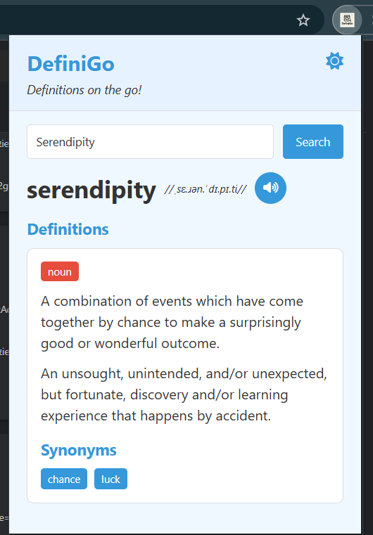
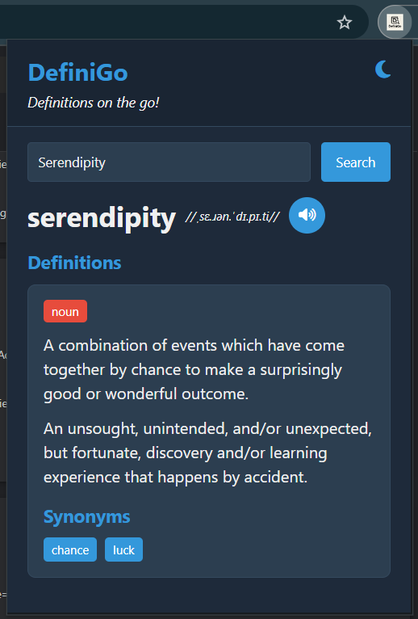
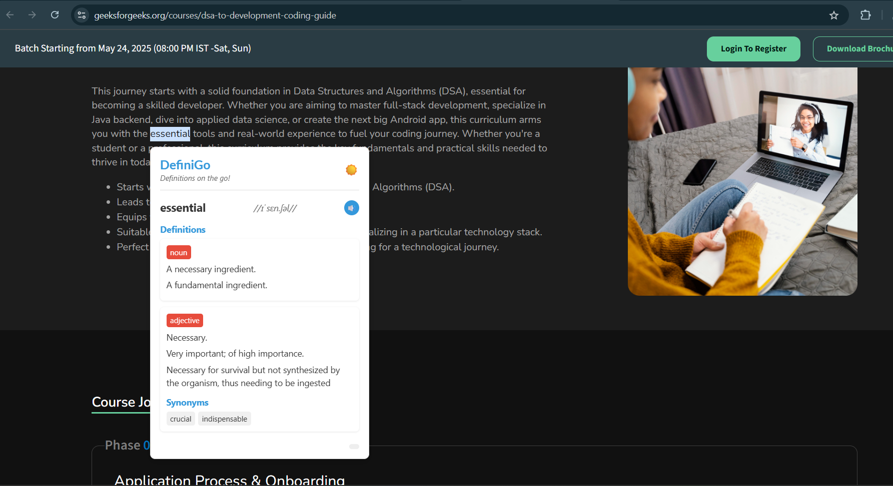
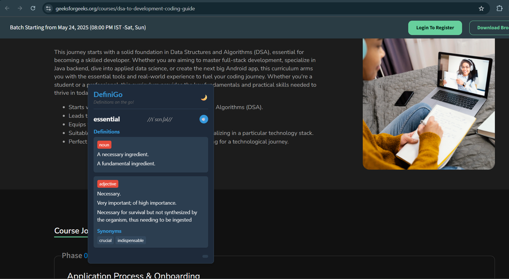

# DefiniGo - Instant Dictionary Extension

DefiniGo is a powerful and intuitive instant dictionary extension that provides quick word definitions, synonyms, and pronunciation on the go. Designed for efficiency, it helps users enhance their vocabulary with just a click.

## Features
- 📝 **Instant Definitions** – Get word meanings instantly.
- 🔍 **Synonym & Antonym Suggestions** – Expand your vocabulary.
- 🎤 **Pronunciation Guide** – Listen to word pronunciations.
- 🌙 **Light & Dark Mode** – Comfortable reading at any time.
- 🚀 **Fast & Lightweight** – Optimized for seamless performance.

## Installation
1. Download the latest version from the [GitHub Repository](https://github.com/malathi-n79/DefiniGo).
2. Extract the downloaded ZIP file to a folder on your computer.
3. Open **Google Chrome** and navigate to `chrome://extensions/`.
4. Enable **Developer mode** (toggle in the top-right corner).
5. Click **Load unpacked** and select the extracted folder.
6. The extension will be installed and ready to use.

## Usage
1. Highlight any word on a webpage.
2. Then right-click and select **DefiniGo: Define Word**.
3. Instantly view the definition, synonyms, and pronunciation.
4. Alternatively, click on the **DefiniGo extension icon** in the Chrome toolbar.
5. Enter a word in the input field to search for its meaning manually.

## Technologies Used
- **JavaScript** – Core logic and API integration
- **HTML & CSS** – Responsive and user-friendly UI
- **Dictionary API** – Fetching real-time word data

## Screenshots
### Using the DefiniGo Extension Icon
1. **Screenshot 1**: Demonstrates entering a word in the input field to search for its meaning manually in light mode.
2. **Screenshot 2**: Demonstrates entering a word in the input field to search for its meaning manually in dark mode.

### Highlighting Words on a Webpage
3. **Screenshot 3**: Displays the popup after highlighting a word on a webpage and right-clicking to select **DefiniGo: Define Word**  in light mode.
4. **Screenshot 4**: Displays the popup after highlighting a word on a webpage and right-clicking to select **DefiniGo: Define Word**  in dark mode.

## Contributing
We welcome contributions! If you’d like to improve DefiniGo:
1. Fork the repository.
2. Create a feature branch (`git checkout -b feature-name`).
3. Commit your changes (`git commit -m "Added new feature"`).
4. Push to the branch (`git push origin feature-name`).
5. Open a Pull Request.

## License
This project is licensed under the [MIT License](LICENSE).

## Contact
📧 Email: malathi3925@gmail.com  
🌐 Website: [DefiniGo.com](#)

Happy Learning with DefiniGo! 🚀
